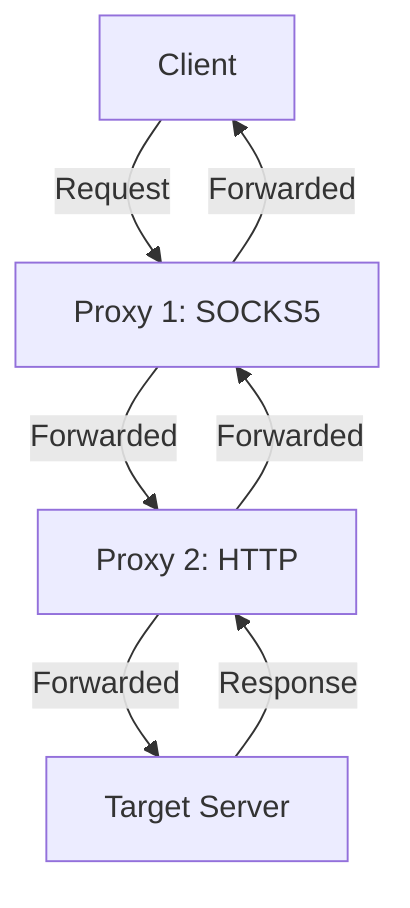

## Proxying Like a Real-Pro
---


## What is a Proxy?


A proxy server acts as an intermediary between a client (your device) and a server (the internet resource you're accessing). It forwards requests and responses, often modifying or inspecting them along the way. Proxies are used for:

- **Privacy**: Hiding your IP address to maintain anonymity.
- **Debugging**: Inspecting HTTP/HTTPS traffic for development or testing.
- **Performance**: Caching content to reduce load times.
- **Security**: Filtering malicious traffic or enforcing access policies.
- **Bypassing Restrictions**: Accessing geo-restricted content or internal networks.

There are several types of proxies:

- **Forward Proxy**: Manages client requests to external servers.
- **Reverse Proxy**: Handles incoming requests to backend servers.
- **Transparent Proxy**: Operates without client configuration.
- **Anonymous Proxy**: Masks client identity.

In a security context, proxies are critical for attackers to cover their tracks and for defenders to monitor or restrict traffic.

## Why Proxy Like a Pro?

Mastering proxies unlocks advanced capabilities:

- Debug complex API interactions for seamless application development.
- Optimize network performance through caching and load balancing.
- Secure sensitive data flows with encrypted proxies.
- Evade detection during penetration testing or bypass geo-restrictions.
- Pivot into internal networks for advanced security testing.

Let’s explore how to set up and use proxies effectively, including the powerful ProxyChains tool for chaining multiple proxies.

## Setting Up a Proxy Server with Squid

Squid is a popular open-source proxy server for caching and forwarding HTTP requests. Here’s how to set it up on an Ubuntu system.

### Step 1: Install Squid

Run the following commands to install Squid:

```bash
sudo apt update
sudo apt install squid
```

### Step 2: Configure Squid

Edit the Squid configuration file at `/etc/squid/squid.conf`:

```bash
sudo nano /etc/squid/squid.conf
```

Add or modify these lines to allow access from your local network:

```plaintext
acl localnet src 192.168.0.0/16
http_access allow localnet
http_port 3128
```

Save and restart Squid:

```bash
sudo systemctl restart squid
```

### Step 3: Test the Proxy

Configure your browser to use the proxy (IP: your server’s IP, Port: 3128). Visit a website, and check Squid’s logs to confirm:

```bash
sudo tail -f /var/log/squid/access.log
```

You’ll see entries like:

```
1635123456.789 127 192.168.1.10 TCP_MISS/200 12345 GET http://example.com/ - HIER_DIRECT/93.184.216.34 text/html
```

## Debugging with a Proxy: Using Charles

Charles Proxy is a fantastic tool for inspecting HTTP/HTTPS traffic, widely used by developers to debug web and mobile apps.

### Setting Up Charles

1. **Download and Install**: Get Charles from [charlesproxy.com](https://www.charlesproxy.com/).
2. **Configure SSL**: Enable SSL proxying in Charles to decrypt HTTPS traffic. Go to `Proxy > SSL Proxying Settings` and add `*.*` to capture all domains.
3. **Set Up Device**: Configure your device to use Charles as a proxy (e.g., IP: your machine’s IP, Port: 8888).

### Example: Capturing API Calls

Let’s say you’re debugging an API call to `https://api.example.com/data`. Open Charles, make the API request, and you’ll see:

- **Request Headers**: Authorization tokens, content types.
- **Response Data**: JSON payloads, status codes.

Here’s a sample Python script to make a request through a proxy using `requests`:

```python
import requests

proxies = {
    'http': 'http://localhost:8888',
    'https': 'http://localhost:8888',
}

response = requests.get('https://api.example.com/data', proxies=proxies)
print(response.json())
```

Save this as `proxy_request.py` and run:

```bash
python proxy_request.py
```

Charles will display the full request and response, helping you debug issues like missing headers or incorrect payloads.

## Advanced Proxying with Nginx as a Reverse Proxy

Nginx is a powerful tool for setting up a reverse proxy to manage backend services. Here’s a quick setup.

### Step 1: Install Nginx

On Ubuntu:

```bash
sudo apt update
sudo apt install nginx
```

### Step 2: Configure Reverse Proxy

Create a new Nginx configuration file:

```bash
sudo nano /etc/nginx/sites-available/reverse-proxy
```

Add:

```nginx
server {
    listen 80;
    server_name proxy.example.com;

    location / {
        proxy_pass http://backend-server:8080;
        proxy_set_header Host $host;
        proxy_set_header X-Real-IP $remote_addr;
    }
}
```

Enable the configuration:

```bash
sudo ln -s /etc/nginx/sites-available/reverse-proxy /etc/nginx/sites-enabled/
sudo nginx -t
sudo systemctl restart nginx
```

This routes traffic from `proxy.example.com` to `backend-server:8080`.

### Step 3: Test It

Access `http://proxy.example.com` in your browser. Nginx will forward requests to the backend server, and you can verify in the Nginx logs:

```bash
sudo tail -f /var/log/nginx/access.log
```

## ProxyChains: Proxying Like a Hacker

### What is ProxyChains?

ProxyChains is an open-source tool for GNU/Linux systems that forces any TCP connection made by an application to go through proxies like TOR, SOCKS4, SOCKS5, or HTTP proxies. It’s a favorite among penetration testers and hackers for anonymizing traffic and bypassing network restrictions.

With ProxyChains, you can:

- Run programs through proxy servers without built-in proxy support (e.g., SSH, telnet, wget, FTP, Nmap).
- Chain multiple proxies to obscure your origin.
- Access internal networks or bypass firewalls.
- Evade detection by routing traffic through proxies across different jurisdictions.

In a security context, ProxyChains is a powerful tool for attackers to hide their true IP address. By chaining proxies, especially across countries, attackers make it difficult for forensics investigators to trace traffic back to the source, as each proxy may require separate legal warrants in different jurisdictions.

### Setting Up ProxyChains


#### Installation

On **Mac OSX** using Homebrew:

```bash
brew install proxychains-ng
```

On **Debian-based Linux**:

```bash
sudo apt-get install proxychains
```

To build from source:

1. Download the latest source from [ProxyChains’ official release page](https://github.com/rofl0r/proxychains-ng/releases).
2. Navigate to the project directory and run:

```bash
./configure
make
sudo make install
```

#### Configuring ProxyChains

The ProxyChains configuration file is typically located at `/etc/proxychains.conf`, `~/.proxychains/proxychains.conf`, or specified via the `-f` flag. ProxyChains searches for the config file in this order:

1. `${PROXYCHAINS_CONF_FILE}` environment variable.
2. `-f` argument provided to the `proxychains` command.
3. `./proxychains.conf`.
4. `$(HOME)/.proxychains/proxychains.conf`.
5. `/etc/proxychains.conf`.

Edit the configuration file:

```bash
sudo nano /etc/proxychains.conf
```

Specify the chaining mode:

- **Strict Chain**: Uses all proxies in order.
- **Dynamic Chain**: Uses all proxies but skips dead ones.
- **Random Chain**: Uses a random combination of proxies (useful for IDS evasion).

Example configuration:

```plaintext
# Enable dynamic chaining
dynamic_chain
# Proxy list: type host port [username password]
socks5 192.168.67.78 1080 lamer secret
http 192.168.89.3 8080 justu hidden
socks4 192.168.1.49 1080
```

Supported proxy types: `socks4`, `socks5`, `http`.

#### Using ProxyChains

Run any command through ProxyChains by prefixing it with `proxychains`:

```bash
proxychains telnet targethost.com
```

To connect to a host through proxies:

```bash
proxychains targethost.com
```

#### Pivoting with ProxyChains

Pivoting allows attackers to access internal machines protected by firewalls by compromising an internet-facing machine (e.g., a web server) and using it as a proxy to reach deeper into the network.

To pivot with ProxyChains:

1. Compromise an internet-facing machine.
2. Add it to the ProxyChains proxy list:

```plaintext
socks5 compromised-server.com 1080
```

3. Run commands through ProxyChains to access internal machines:

```bash
proxychains nmap -sT internal-machine.local
```

#### Nmap via ProxyChains

Perform Nmap scans through proxies:

```bash
proxychains nmap -sT targethost.com
```

#### ProxyChains via SSH

Use SSH as a proxy with ProxyChains:

1. Set up an SSH dynamic proxy:

```bash
ssh -D 127.0.0.1:8080 user@targethost.com
```

2. Add the SSH proxy to `proxychains.conf`:

```plaintext
socks5 127.0.0.1 8080
```

3. Run commands through ProxyChains:

```bash
proxychains curl http://internal-machine.local
```

## Visualizing Proxy Traffic

Here’s a Mermaid diagram illustrating proxy chaining with ProxyChains:



This shows how ProxyChains routes traffic through multiple proxies to reach the target server.

## Automating Proxy Setup with Ansible


For DevOps pros, automate Squid setup with Ansible. Here’s a playbook:

```yaml
- name: Install and configure Squid proxy
  hosts: proxy_servers
  become: yes
  tasks:
    - name: Install Squid
      apt:
        name: squid
        state: present
        update_cache: yes

    - name: Configure Squid
      lineinfile:
        path: /etc/squid/squid.conf
        line: "{{ item }}"
      loop:
        - "acl localnet src 192.168.0.0/16"
        - "http_access allow localnet"
        - "http_port 3128"

    - name: Restart Squid
      systemd:
        name: squid
        state: restarted
```

Save as `setup_squid.yml` and run:

```bash
ansible-playbook setup_squid.yml
```

## Pro Tips for Proxying

- **Security**: Secure proxies with authentication or IP whitelisting to prevent abuse. For ProxyChains, use strong credentials for authenticated proxies.
- **Logging**: Enable detailed logging for troubleshooting. For Squid, add `debug_options ALL,1` to `squid.conf`. For ProxyChains, enable verbose mode with `-v`.
- **Performance**: Use caching in Squid for performance but clear caches periodically. For ProxyChains, test proxies to ensure low latency.
- **Evasion**: Use random chaining in ProxyChains to evade IDS detection during penetration testing.
- **Tools**: Explore Burp Suite for security testing, mitmproxy for scriptable proxying, or TOR for anonymous browsing.

## Advanced ProxyChains Techniques

### Chaining with TOR

To use ProxyChains with TOR:

1. Install TOR:

```bash
sudo apt install tor
sudo systemctl start tor
```

2. Add TOR to `proxychains.conf`:

```plaintext
socks5 127.0.0.1 9050
```

3. Run commands through TOR:

```bash
proxychains curl https://example.com
```

### Testing Proxy Chains

Verify your proxy chain is working:

```bash
proxychains curl https://ifconfig.me
```

This returns the IP address of the last proxy in the chain, confirming anonymization.

### Handling Dead Proxies

Use Dynamic Chain mode to skip unresponsive proxies automatically. Test proxies beforehand with:

```bash
curl --proxy socks5://192.168.67.78:1080 https://example.com
```

## Conclusion

Proxying like a pro means mastering tools like Squid, Charles, Nginx, and ProxyChains to control, anonymize, and debug network traffic. Whether you’re bypassing firewalls, pivoting into internal networks, or evading detection, these tools empower you to manipulate traffic like a seasoned hacker or developer. Experiment with the provided scripts, automate setups, and chain proxies to elevate your skills. Proxy smart, stay secure, and have fun!

**Categories**: Hacking, Networking, Security  

---

**Share on**  
[Twitter](https://x.com/) | [Facebook](https://facebook.com/) | [LinkedIn](https://linkedin.com/)